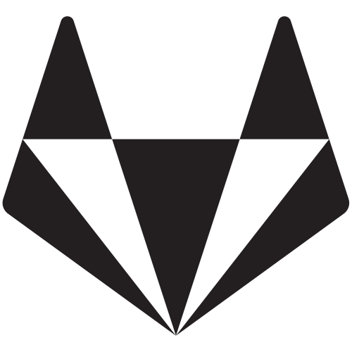

# Hello and welcome 👋

My name is Mario. I am a **Computer Systems Engineer** with decades of professional Software Engineering and Software Development experience. I specialize in **Architecting** and **Implementing** Performant Real-Time **Scalable Web Services**.

Over the years, I've been lucky enough to manage, mentor, and guide junior and experienced engineers, both collocated and distributed across multiple timezones; in recent years, I specialized in [**Go**](https://go.dev) and **Amazon Web Services** to build Web-based Enterprise Systems, using REST and gRPC.

During my career, I built all types of software, such as on-premise Automation Systems, [Linux Accessibility](https://www.mono-project.com/archived/accessibility_team/) Desktop Applications, Cloud Governance and Compliance Systems, and Distributed Cloud-based Advertising Systems.

I also have a [Gitlab landing page](https://gitlab.com/MarioCarrion). Over there, I have more Open Source projects I'm currently maintaining and updating.

Feel free to reach out to me at: `<blog><@><carrion.ws>`.

**Keep it up, don't give up!**

## 🔭 I'm currently working on

- [`todo-api-microservice-example`](https://github.com/MarioCarrion/todo-api-microservice-example): Go microservice tutorial project using Domain Driven Design and Onion Architecture!
- [`grpc-microservice-example`](https://github.com/MarioCarrion/grpc-microservice-example): Go microservice tutorial project using gRPC.
- [`videos`](https://github.com/MarioCarrion/videos): Slides and examples used for my training videos.
- [`nit`](https://github.com/MarioCarrion/nit): Opinionated code organization linter for Go projects.
- [`swagger-lint`](https://github.com/MarioCarrion/swagger-lint): Opinionated Swagger 2.0 Spec linter.

## 🌱 I'm currently learning

- [Rust](https://www.rust-lang.org/)
- [WebAssembly](https://webassembly.org/)
