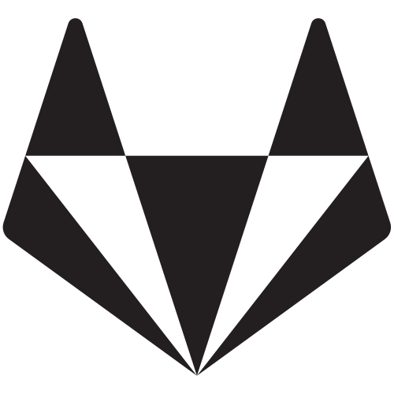

# Hi, I'm Mario 👋

A hands-on Software Architect and Lead Backend Engineer with **20+ years** of experience designing and building performant, real-time, scalable web services.

---

I believe great software is built at the intersection of strong architecture and deep implementation, so I stay close to the code. In recent years, I've been building Web-based Enterprise Systems with [Go](https://go.dev/) using REST and gRPC.

I've guided, mentored, and managed both junior and experienced engineers, in-office and remotely across time zones.

Over the course of my career, I've shipped production software across a wide range of industries, including on-premises Automation Systems, [Linux Accessibility Desktop Applications](https://www.mono-project.com/archived/accessibility_team/), [Highly Scalable Distributed Cloud-based Advertising Systems](https://www.businessrecord.com/meredith-acquires-selectable-media/), [Cloud Governance and Compliance Systems](https://www.capitalonecareers.com/creating-a-tech-first-career-path-tech-cdev), and [Media Streaming Services](https://www.paramount.com/careers).

Explore my [Gitlab](https://gitlab.com/MarioCarrion) profile as well, to learn more about some of the Open Source projects I'm currently maintaining. 

If you're building distributed systems at scale and need someone who can both design the architecture and own the implementation, let's talk: `<contact><@><carrion.ws>`.

**Keep it up, don't give up!**

## 🔭 My videos use the following repositories

- [**`todo-api-microservice-example`**](https://github.com/MarioCarrion/todo-api-microservice-example): Go microservice tutorial project using Domain Driven Design and Onion Architecture!
- [**`grpc-microservice-example`**](https://github.com/MarioCarrion/grpc-microservice-example): Go microservice tutorial project using gRPC.
- [**`videos`**](https://github.com/MarioCarrion/videos): Slides and examples used for my training videos.
